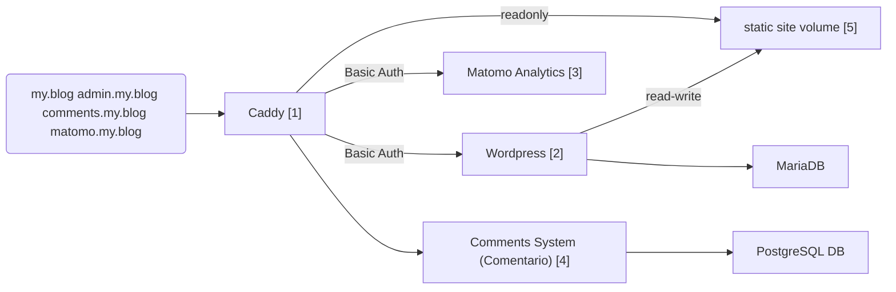

# Static Wordpress

## Motivation

My mum has had blog based on Wordpress for well over 10 years.
Now, wordpress is notoriously plagued by security issues and it is very important to keep your instance always up-to-date,
which means persistent maintenance efforts for hosting that blog. And who's responsible for patching wordpress and its plugins? Me, of course. :)

In order to reduce attack surface and improve my nightly sleep I've long been considering to find a way of making her blog static
(only HTML+CSS, no server side logic), but still provide her the familiar administration interface of Wordpress for managing content.

## Architecture

The core of the setup is a docker/podman compose file with the following services:

1. A caddy reverse proxy which forwards to the other services, serves the static page from a volume and does basic authentication for Wordpress and Matomo to reduce the services' attack surface (other authentication options are possible with Caddy addons, e.g [caddy-security](https://github.com/greenpau/caddy-security) or external authentication providers)
2. The [wordpress][wp] page, accessible only behind Caddy's basic authentication layer for editing blog contents, theming, etc. -> just like with a normal wordpress site. Wordpress also requires a database, so we're also including a MariaDB instance
3. [Matomo][matomo] as privacy friendly analytics service that will be intergrated into the generated pages, since the static site itself has no way of collecting and storing any data.
4. [Comentario][comentario] as comments system since comments can't be solved within a static page either (they need to be stored in a backend, a postgresql database in this case)

[wp]: https://wordpress.com/
[matomo]: https://matomo.org
[comentario]: https://comentario.app/en/

